# Roadmap

<!-- Generated by scripts/journal.ts build. Do not edit. -->

Everything not built yet. Items: `roadmap/items/`. Unsorted ideas: [[roadmap/inbox]].

## Now

- [[roadmap/items/R001-context-system|R001]] Three-layer context system with drift detection — graduated · infra · → [[features/context-system/plan|context-system]]
- [[roadmap/items/R002-deno-runtime|R002]] Deno as the only runtime — graduated · infra, core, host · → [[features/deno-runtime/plan|deno-runtime]]
- [[roadmap/items/R003-stt-engine|R003]] Local speech-to-text engine for Ana — graduated · product · → [[features/stt-engine/plan|stt-engine]]
- [[roadmap/items/R004-agent-harness|R004]] Uniform agent harness and tmux orchestration — graduated · infra · → [[features/agent-harness/plan|agent-harness]]
- [[roadmap/items/R005-codebase-review|R005]] Codebase review and fixes — graduated · core, host, infra, product · → [[features/codebase-review/plan|codebase-review]]

## Next

- [[roadmap/items/R101-context-transparency-and-control|R101]] Context transparency and control — inspect, compose and exclude what the model sees — shaped · core, host
- [[roadmap/items/R106-ana-application|R106]] Ana — voice-driven personal assistant app on the kuib engine — shaped · product, core
- [[roadmap/items/R107-ana-persistent-conversation|R107]] Ana persistent conversation with structured fact extraction — shaped · product, core
- [[roadmap/items/R200-message-materializer-and-crash-recovery|R200]] Messages snapshot materializer, persistence cursor and crash recovery — shaped · core
- [[roadmap/items/R206-interrupt-resolution-for-tool-calls|R206]] Interrupts resolve every pending tool call in the log — shaped · core, host
- [[roadmap/items/R210-part-exclusion-and-context-curation|R210]] Per-part exclusion and context curation — shaped · core, host
- [[roadmap/items/R220-daemon-idle-reap|R220]] Daemon idle self-reap and no leaked daemons from tests — idea · core
- [[roadmap/items/R300-own-tui-library|R300]] kuib's own terminal UI library — shaped · host
- [[roadmap/items/R301-session-screen|R301]] Session screen and v1 pane layout — shaped · host
- [[roadmap/items/R302-ui-host-attach|R302]] UI host attaches to serve — log reads, doorbell, submit — shaped · host, core
- [[roadmap/items/R311-screen-iteration-harness|R311]] Screen iteration harness — frame dumps, snapshot tests, wireframe picker — shaped · host, infra
- [[roadmap/items/R313-host-protocol-contract|R313]] HostProtocol contract shared by every host — idea · host, core
- [[roadmap/items/R402-per-user-daemon-local-auth|R402]] Per-user daemon scoping with socket-permission local auth — shaped · core, infra
- [[roadmap/items/R403-command-risk-approval-flow|R403]] Command risk scoring and approval flow — shaped · core, host
- [[roadmap/items/R410-telemetry-on-deno|R410]] Telemetry on Deno — service naming, span re-check, built-in OTel — idea · infra, host
- [[roadmap/items/R412-full-gate-verification|R412]] Full-gate verification — madge in check, hermetic spawn teardown — shaped · infra, core

## Later

- [[roadmap/items/R100-transparent-comprehension-first-agent|R100]] Kuib north star — a transparent, comprehension-first coding agent — shaped · core, host
- [[roadmap/items/R102-comprehension-layer|R102]] Comprehension layer — hunks on full files, ledger, intent and blast radius — shaped · core, host
- [[roadmap/items/R103-intervention-ladder|R103]] Graded intervention ladder for autonomous runs — idea · core, host
- [[roadmap/items/R105-replicated-session-log|R105]] Multi-device sessions — replicated event log with coordinator-lease leadership — shaped · core, infra
- [[roadmap/items/R108-wake-word-listening|R108]] Wake word and always-on listening for Ana — idea · product
- [[roadmap/items/R109-kokoro-local-tts|R109]] Kokoro local TTS for instant acknowledgments — shaped · product
- [[roadmap/items/R111-hex-sdk-vs-fluidaudio|R111]] Streaming Parakeet — FluidAudio direct vs Hex SDK batch — shaped · product
- [[roadmap/items/R112-phone-dictation-client|R112]] Phone dictation client streaming to minerva — idea · product
- [[roadmap/items/R113-ana-proactive-notifications|R113]] Ana proactive monitoring and notifications — idea · product
- [[roadmap/items/R114-nat-keepalive-minerva|R114]] NAT keepalive service on minerva for warm voice paths — shaped · infra
- [[roadmap/items/R201-append-validation-and-conflicts|R201]] Engine-side append validation, optimistic concurrency and edit locks — shaped · core
- [[roadmap/items/R202-event-log-write-behind|R202]] Hot-path throughput — write-behind event log and validation only at boundaries — shaped · core
- [[roadmap/items/R203-event-taxonomy-completion|R203]] Complete the event taxonomy — retries, session, model switch, versions, tool output — shaped · core, host
- [[roadmap/items/R204-tool-approval-gate|R204]] Tool approval gate with persisted approval state and command editing — shaped · core, host
- [[roadmap/items/R205-risk-scoring-and-security-profiles|R205]] Operation × target risk scoring with per-device security profiles — shaped · core, infra
- [[roadmap/items/R207-checkpoints-and-context-assembly|R207]] Checkpoints as bookmarks and checkpoint-driven context assembly — shaped · core
- [[roadmap/items/R208-context-compaction|R208]] Context compaction as an ordinary summary message — shaped · core, host
- [[roadmap/items/R209-message-editing-and-branching|R209]] Editable messages, message versions and conversation branching — idea · core, host
- [[roadmap/items/R211-discussions-overlay|R211]] Discussions — a PartID[] overlay, toggleable in context and shareable across sessions — shaped · core, host
- [[roadmap/items/R212-schema-migration-chain|R212]] Schema migration chain and JSON-schema snapshot test — shaped · core, infra
- [[roadmap/items/R213-mesh-protocol-fields|R213]] Session and Device schemas, and mesh fields on tools and tool calls — shaped · core, host
- [[roadmap/items/R216-provider-plugins-and-auth|R216]] Provider plugins, model catalog and auth-method union (API key | OAuth) — idea · core, infra
- [[roadmap/items/R217-agent-tool-set-growth|R217]] Grow the agent tool set — write, exec, search, subagent and think tools — idea · core
- [[roadmap/items/R219-config-store-and-secret-storage|R219]] ConfigStore seam for user preferences and OS secure storage for secrets — idea · infra, core
- [[roadmap/items/R303-single-binary-roles|R303]] Single compiled binary with argv-selected roles — shaped · host, infra
- [[roadmap/items/R304-background-service-install|R304]] Background service install (launchd / systemd) — shaped · host, infra
- [[roadmap/items/R305-web-host-viewer|R305]] Web host as a pure viewer over SSE — shaped · host, core
- [[roadmap/items/R306-discussions-context-control|R306]] Discussions and part-level context control in the conversation — shaped · host, core
- [[roadmap/items/R307-payload-preview-cache-cost|R307]] Payload preview and cache-cost transparency — shaped · host, core
- [[roadmap/items/R309-multi-device-working-context|R309]] Multi-device working context — device badge, switcher, per-device cwd — shaped · host, core
- [[roadmap/items/R310-context-bootstrap|R310]] Context bootstrap for greenfield repos — idea · core, host
- [[roadmap/items/R312-ui-state-persistence|R312]] UI state persistence and live config reload — idea · host
- [[roadmap/items/R400-headscale-derp-control-plane|R400]] Self-hosted Headscale + DERP control plane for the mesh — shaped · infra, core
- [[roadmap/items/R401-mesh-distributed-state|R401]] Mesh node composition and distributed state — idea · core, infra
- [[roadmap/items/R404-per-device-security-profiles|R404]] Per-device security profiles and approval thresholds — shaped · core, infra
- [[roadmap/items/R405-daemon-threat-hardening|R405]] Daemon threat-model hardening for the mesh — idea · core, infra
- [[roadmap/items/R406-signed-binary-distribution|R406]] Signed single-binary distribution with service install — idea · infra, host
- [[roadmap/items/R407-os-secure-storage|R407]] OS secure storage for API keys and node keys — shaped · infra
- [[roadmap/items/R408-web-host-auth|R408]] Web host auth model for kuib web and code.kuib.ai — shaped · host, infra
- [[roadmap/items/R411-tui-lint-bucket|R411]] Component-layer lint rules for kuib's own TUI library — idea · infra

## Maybe

- [[roadmap/items/R104-editor-handoff|R104]] Editor handoff — read-first comprehension UI with explicit unlock to edit — idea · host
- [[roadmap/items/R110-mimo-asr-fallback|R110]] MiMo ASR as cloud STT fallback — idea · product
- [[roadmap/items/R115-echo-dot-far-field-node|R115]] Echo Dot jailbreak into a far-field mic and speaker node (parked) — idea · product
- [[roadmap/items/R116-voice-cloning-ana|R116]] Voice cloning for Ana's persona — idea · product
- [[roadmap/items/R214-replicated-session-log|R214]] Replicated session log — leader-authored, epoch-fenced, snapshot derived per node — idea · core, infra
- [[roadmap/items/R215-reducer-annotated-state|R215]] Reducer-annotated session state and thread-keyed checkpointing — idea · core
- [[roadmap/items/R218-pluggable-fs-and-shell-backends|R218]] Pluggable fs and shell backends — local, Postgres, nsjail sandbox — idea · core, infra
- [[roadmap/items/R308-nvim-bridge|R308]] Embedded Neovim code pane (nvim bridge) — idea · host
- [[roadmap/items/R409-platform-directory-corrections|R409]] Platform directory layout corrections for Windows and macOS runtime — idea · infra
- [[roadmap/items/R413-self-alias-imports|R413]] Literal `@/` self-alias for intra-package imports — idea · infra
- [[roadmap/items/R414-scheduled-drift-audit|R414]] Scheduled drift audit of domain context — idea · infra

## Shipped · absorbed · dropped

_none_

## Graph

```mermaid
flowchart LR
  subgraph now
    R001["R001 · Three-layer context system with drift detection"]
    R002["R002 · Deno as the only runtime"]
    R003["R003 · Local speech-to-text engine for Ana"]
    R004["R004 · Uniform agent harness and tmux orchestration"]
    R005["R005 · Codebase review and fixes"]
  end
  subgraph next
    R101["R101 · Context transparency and control — inspect, compose and exclude what the model sees"]
    R106["R106 · Ana — voice-driven personal assistant app on the kuib engine"]
    R107["R107 · Ana persistent conversation with structured fact extraction"]
    R200["R200 · Messages snapshot materializer, persistence cursor and crash recovery"]
    R206["R206 · Interrupts resolve every pending tool call in the log"]
    R210["R210 · Per-part exclusion and context curation"]
    R220["R220 · Daemon idle self-reap and no leaked daemons from tests"]
    R300["R300 · kuib's own terminal UI library"]
    R301["R301 · Session screen and v1 pane layout"]
    R302["R302 · UI host attaches to serve — log reads, doorbell, submit"]
    R311["R311 · Screen iteration harness — frame dumps, snapshot tests, wireframe picker"]
    R313["R313 · HostProtocol contract shared by every host"]
    R402["R402 · Per-user daemon scoping with socket-permission local auth"]
    R403["R403 · Command risk scoring and approval flow"]
    R410["R410 · Telemetry on Deno — service naming, span re-check, built-in OTel"]
    R412["R412 · Full-gate verification — madge in check, hermetic spawn teardown"]
  end
  subgraph later
    R100["R100 · Kuib north star — a transparent, comprehension-first coding agent"]
    R102["R102 · Comprehension layer — hunks on full files, ledger, intent and blast radius"]
    R103["R103 · Graded intervention ladder for autonomous runs"]
    R105["R105 · Multi-device sessions — replicated event log with coordinator-lease leadership"]
    R108["R108 · Wake word and always-on listening for Ana"]
    R109["R109 · Kokoro local TTS for instant acknowledgments"]
    R111["R111 · Streaming Parakeet — FluidAudio direct vs Hex SDK batch"]
    R112["R112 · Phone dictation client streaming to minerva"]
    R113["R113 · Ana proactive monitoring and notifications"]
    R114["R114 · NAT keepalive service on minerva for warm voice paths"]
    R201["R201 · Engine-side append validation, optimistic concurrency and edit locks"]
    R202["R202 · Hot-path throughput — write-behind event log and validation only at boundaries"]
    R203["R203 · Complete the event taxonomy — retries, session, model switch, versions, tool output"]
    R204["R204 · Tool approval gate with persisted approval state and command editing"]
    R205["R205 · Operation × target risk scoring with per-device security profiles"]
    R207["R207 · Checkpoints as bookmarks and checkpoint-driven context assembly"]
    R208["R208 · Context compaction as an ordinary summary message"]
    R209["R209 · Editable messages, message versions and conversation branching"]
    R211["R211 · Discussions — a PartID[] overlay, toggleable in context and shareable across sessions"]
    R212["R212 · Schema migration chain and JSON-schema snapshot test"]
    R213["R213 · Session and Device schemas, and mesh fields on tools and tool calls"]
    R216["R216 · Provider plugins, model catalog and auth-method union (API key | OAuth)"]
    R217["R217 · Grow the agent tool set — write, exec, search, subagent and think tools"]
    R219["R219 · ConfigStore seam for user preferences and OS secure storage for secrets"]
    R303["R303 · Single compiled binary with argv-selected roles"]
    R304["R304 · Background service install (launchd / systemd)"]
    R305["R305 · Web host as a pure viewer over SSE"]
    R306["R306 · Discussions and part-level context control in the conversation"]
    R307["R307 · Payload preview and cache-cost transparency"]
    R309["R309 · Multi-device working context — device badge, switcher, per-device cwd"]
    R310["R310 · Context bootstrap for greenfield repos"]
    R312["R312 · UI state persistence and live config reload"]
    R400["R400 · Self-hosted Headscale + DERP control plane for the mesh"]
    R401["R401 · Mesh node composition and distributed state"]
    R404["R404 · Per-device security profiles and approval thresholds"]
    R405["R405 · Daemon threat-model hardening for the mesh"]
    R406["R406 · Signed single-binary distribution with service install"]
    R407["R407 · OS secure storage for API keys and node keys"]
    R408["R408 · Web host auth model for kuib web and code.kuib.ai"]
    R411["R411 · Component-layer lint rules for kuib's own TUI library"]
  end
  subgraph maybe
    R104["R104 · Editor handoff — read-first comprehension UI with explicit unlock to edit"]
    R110["R110 · MiMo ASR as cloud STT fallback"]
    R115["R115 · Echo Dot jailbreak into a far-field mic and speaker node (parked)"]
    R116["R116 · Voice cloning for Ana's persona"]
    R214["R214 · Replicated session log — leader-authored, epoch-fenced, snapshot derived per node"]
    R215["R215 · Reducer-annotated session state and thread-keyed checkpointing"]
    R218["R218 · Pluggable fs and shell backends — local, Postgres, nsjail sandbox"]
    R308["R308 · Embedded Neovim code pane (nvim bridge)"]
    R409["R409 · Platform directory layout corrections for Windows and macOS runtime"]
    R413["R413 · Literal `@/` self-alias for intra-package imports"]
    R414["R414 · Scheduled drift audit of domain context"]
  end
  R001 --> R004
  R004 --> R005
  R101 --> R100
  R102 --> R100
  R103 --> R100
  R104 --> R100
  R101 -. converges .- R210
  R101 --> R102
  R102 -. converges .- R103
  R102 -. converges .- R209
  R102 --> R104
  R400 --> R105
  R105 -. converges .- R214
  R003 --> R106
  R216 --> R106
  R106 --> R107
  R003 --> R108
  R003 --> R110
  R003 --> R111
  R003 --> R112
  R106 --> R113
  R106 --> R116
  R200 -. converges .- R214
  R203 --> R201
  R201 -. converges .- R204
  R205 --> R204
  R203 --> R204
  R204 -. converges .- R403
  R213 --> R205
  R205 -. converges .- R403
  R205 -. converges .- R404
  R200 --> R207
  R207 --> R208
  R207 --> R209
  R209 -. converges .- R210
  R210 -. converges .- R306
  R207 --> R211
  R211 -. converges .- R306
  R213 -. converges .- R309
  R213 --> R214
  R201 --> R214
  R400 --> R214
  R219 --> R216
  R204 --> R217
  R205 --> R217
  R219 -. converges .- R407
  R219 -. converges .- R401
  R220 -. converges .- R412
  R002 --> R300
  R300 --> R301
  R302 --> R301
  R200 --> R302
  R302 -. converges .- R313
  R002 --> R303
  R303 -. converges .- R406
  R303 --> R304
  R302 --> R305
  R313 --> R305
  R214 --> R305
  R305 -. converges .- R408
  R301 --> R306
  R306 -. converges .- R307
  R301 --> R307
  R301 --> R308
  R301 --> R309
  R301 --> R310
  R300 --> R311
  R300 --> R312
  R400 --> R401
  R403 --> R404
  R403 --> R405
  R406 --> R405
  R407 --> R405
  R300 --> R411
  R001 --> R414
  classDef closed fill:#eee,stroke:#999,color:#666
```

