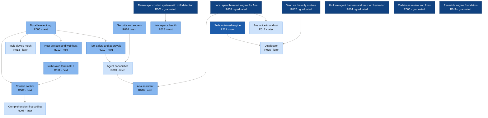

# Roadmap

<!-- Generated by pnpm journal build. Do not edit. -->

The initiatives not built yet, one file per item in `roadmap/items/`. Absorbed items stay on disk behind the initiative that absorbed them.

## Now

- [[roadmap/items/R001-context-system|R001]] Three-layer context system with drift detection — graduated · infra · → [[features/context-system/plan|context-system]]
- [[roadmap/items/R002-deno-runtime|R002]] Deno as the only runtime — graduated · infra, core, host · → [[features/deno-runtime/plan|deno-runtime]]
- [[roadmap/items/R003-stt-engine|R003]] Local speech-to-text engine for Ana — graduated · product · → [[features/stt-engine/plan|stt-engine]]
- [[roadmap/items/R004-agent-harness|R004]] Uniform agent harness and tmux orchestration — graduated · infra · → [[features/agent-harness/plan|agent-harness]]
- [[roadmap/items/R005-codebase-review|R005]] Codebase review and fixes — graduated · core, host, infra, product · → [[features/codebase-review/plan|codebase-review]]
- [[roadmap/items/R019-engine-foundation|R019]] Reusable engine foundation — application boundaries and efficient Deno deployment — graduated · core, host, infra, product · → [[features/engine-foundation/plan|engine-foundation]] · overlaps R007, R009, R013, R015, R221
- [[roadmap/items/R221-self-contained-engine|R221]] Self-contained engine — one entry that owns its wiring and its single-instance start — shaped · core, host · overlaps R012, R019

## Next

- [[roadmap/items/R006-durable-event-log|R006]] Durable event log — idea · core, host, infra
- [[roadmap/items/R007-context-control|R007]] Context control — see and shape what the model sees — idea · core, host · overlaps R019
- [[roadmap/items/R010-tool-safety-and-approvals|R010]] Tool safety and approvals — idea · core, host, infra · overlaps R013, R014
- [[roadmap/items/R011-own-terminal-ui|R011]] kuib's own terminal UI — idea · host, infra · overlaps R013
- [[roadmap/items/R012-host-protocol-and-web-host|R012]] Host protocol and web host — idea · host, core, infra · overlaps R013, R221
- [[roadmap/items/R014-security-and-secrets|R014]] Security and secrets — idea · core, infra · overlaps R010, R015
- [[roadmap/items/R016-ana-assistant|R016]] Ana assistant — idea · product, core
- [[roadmap/items/R018-workspace-health|R018]] Workspace health — idea · infra, core, host

## Later

- [[roadmap/items/R008-comprehension-first-coding|R008]] Comprehension-first coding — idea · core, host
- [[roadmap/items/R009-agent-capabilities|R009]] Agent capabilities — providers, tools and backends — idea · core, infra · overlaps R019
- [[roadmap/items/R013-multi-device-mesh|R013]] Multi-device mesh — idea · core, host, infra · overlaps R010, R011, R012, R019
- [[roadmap/items/R015-distribution|R015]] Distribution — one signed binary, installed as a service — idea · host, infra · overlaps R014, R019
- [[roadmap/items/R017-ana-voice|R017]] Ana voice in and out — idea · product, infra

## Maybe

_none_

## Shipped · dropped

_none_

## Graph

Top down: work in flight or shipped on the top row, then each initiative one row below its last prerequisite; darker is sooner. Overlaps are listed above, not drawn.

```mermaid
---
config:
  theme: base
  themeVariables:
    lineColor: "#8a8984"
  flowchart:
    curve: basis
    padding: 12
    nodeSpacing: 28
    rankSpacing: 48
    wrappingWidth: 400
---
flowchart TB
  R001["Three-layer context system with drift detection<br/>R001 · graduated"]:::graduated
  R002["Deno as the only runtime<br/>R002 · graduated"]:::graduated
  R003["Local speech-to-text engine for Ana<br/>R003 · graduated"]:::graduated
  R004["Uniform agent harness and tmux orchestration<br/>R004 · graduated"]:::graduated
  R005["Codebase review and fixes<br/>R005 · graduated"]:::graduated
  R019["Reusable engine foundation<br/>R019 · graduated"]:::graduated
  R006["Durable event log<br/>R006 · next"]:::next
  R014["Security and secrets<br/>R014 · next"]:::next
  R017["Ana voice in and out<br/>R017 · later"]:::later
  R018["Workspace health<br/>R018 · next"]:::next
  R221["Self-contained engine<br/>R221 · now"]:::now
  R010["Tool safety and approvals<br/>R010 · next"]:::next
  R012["Host protocol and web host<br/>R012 · next"]:::next
  R013["Multi-device mesh<br/>R013 · later"]:::later
  R015["Distribution<br/>R015 · later"]:::later
  R009["Agent capabilities<br/>R009 · later"]:::later
  R011["kuib's own terminal UI<br/>R011 · next"]:::next
  R007["Context control<br/>R007 · next"]:::next
  R016["Ana assistant<br/>R016 · next"]:::next
  R008["Comprehension-first coding<br/>R008 · later"]:::later
  R003 --> R017
  R001 --> R018
  R006 --> R010
  R006 --> R012
  R006 --> R013
  R002 ---> R015
  R221 --> R015
  R010 --> R009
  R014 ---> R009
  R012 --> R011
  R006 ----> R007
  R011 --> R007
  R003 -----> R016
  R009 --> R016
  R007 --> R008
  classDef shipped fill:#f0efec,stroke:#a3a29c,color:#52514e
  classDef graduated fill:#104281,stroke:#0d366b,color:#ffffff
  classDef now fill:#1c5cab,stroke:#104281,color:#ffffff
  classDef next fill:#86b6ef,stroke:#256abf,color:#0b0b0b
  classDef later fill:#cde2fb,stroke:#6da7ec,color:#0b0b0b
  classDef maybe fill:#fcfcfb,stroke:#86b6ef,color:#52514e,stroke-dasharray:4 3
```
